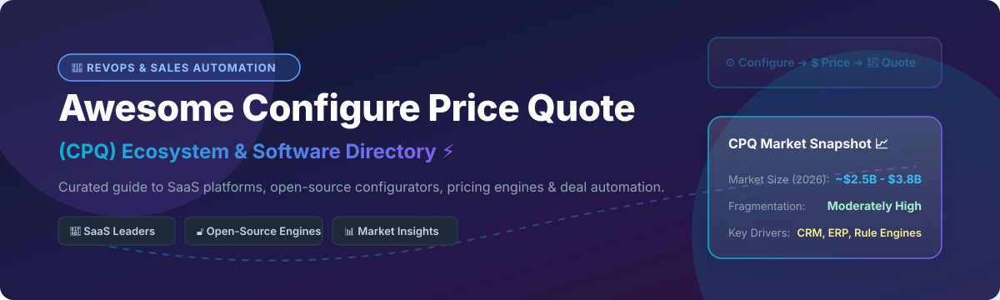

# Awesome Configure Price Quote (CPQ) 🚀

 

## 📌 Top Configure Price Quote (CPQ) Platforms & Open-Source Ecosystem

**Curated List of SaaS CPQ Products, Pricing Engines & Open-Source GitHub Projects** ⚡

*Focused on Product Configuration, Guided Selling, Dynamic Pricing Rules, Quote Generation & RevOps Deal Automation.* 🎯

> **SEO Keywords / Key Topics:** Configure Price Quote, CPQ Software, Salesforce CPQ, Open Source CPQ, Product Configurator Engine, RevOps Automation, DealHub, Pricing Rules Engine, Quote-to-Cash (Q2C), B2B Sales Quoting.

---

## 💡 Overview & Market Insights

This repository tracks notable **SaaS platforms** and **open-source projects** for **Configure Price Quote (CPQ)**. These software systems empower B2B sales teams and RevOps engineers to configure complex product catalog options, enforce dynamic pricing and volume discount rules, generate accurate PDF proposals/quotes, and streamline deal approval workflows—seamlessly integrated with CRM and ERP platforms. 📊

### 🌐 Market Size & Fragmentation Analysis
> **Market Size & Structure:** The global **Configure Price Quote (CPQ)** software market is estimated at **$2.5 Billion – $3.8 Billion**, experiencing a ~13-16% CAGR driven by enterprise digital transformation and subscription billing models. The sector is **moderately fragmented**: while tier-1 CRM giants (Salesforce, Oracle, SAP) dominate enterprise deals, specialized vendors (DealHub, Logik.io, PROS) and open-source pricing engines thrive across mid-market, manufacturing, and custom RevOps stacks. 🏛️

---

## 📑 Table of Contents
- [💼 SaaS / Hosted CPQ Platforms](#-saas--hosted-cpq-platforms)
- [🔓 Open-Source GitHub Projects](#-open-source-github-projects)
- [🛠️ Implementation & Architecture Playbook](#%EF%B8%8F-implementation--architecture-playbook)
- [🤝 Support & Community](#-support--community)
- [🤝 How to Contribute](#-how-to-contribute)
- [⚠️ Disclaimer](#%EF%B8%8F-disclaimer)
- [📈 Star History](#-star-history)

---

## 💼 SaaS / Hosted CPQ Platforms

The table below summarizes leading commercial SaaS CPQ vendors, sorted in descending order by enterprise valuation and market capitalization / scale. 🏢

| Platform 🚀 | Market Scale & Valuation / Revenue 💰 | Starting Price 💵 | Free Tier / Trial Limit ⌛ | Core Focus & Features 🎯 |
| :--- | :--- | :--- | :--- | :--- |
| **[Salesforce CPQ](https://www.salesforce.com/products/cpq/)** ⚡ | **~$300B Market Cap** (Salesforce Inc.) | $75 / user / month (CPQ Starter) | 30-day free trial on Salesforce Developer Edition | Native Salesforce guided selling, complex rules, quote-to-cash, and CRM integration. |
| **[Oracle CPQ](https://www.oracle.com/cx/sales/cpq/)** 🏛️ | **~$380B Market Cap** (Oracle Corp.) | $240 / user / month (Oracle CX Sales CPQ) | 30-day free trial with $300 Oracle Cloud credits | Enterprise-grade configuration engine, multi-level BOMs, approval workflows, and ERP sync. |
| **[HubSpot CPQ](https://www.hubspot.com/)** 🧡 | **~$30B Market Cap** (HubSpot Inc.) | $90 / month (Commerce Hub / Sales Hub Pro) | Free Forever plan (limited to 5 template quotes/mo, basic payment links) | Lightweight quote building and product catalog management integrated with HubSpot CRM. |
| **[PandaDoc CPQ](https://www.pandadoc.com/)** 📄 | **~$1B+ Valuation** | $19 / user / month (Essentials Tier) | 14-day free trial (full features, max 5 documents created during trial) | Interactive document generation, CPQ quoting tables, e-signatures, and workflow automation. |
| **[PROS CPQ](https://pros.com/)** 🤖 | **~$1.2B Market Cap** (PROS Holdings - PRO) | $60 / user / month (Smart CPQ Base) | 14-day guided sandbox demo upon sales request | AI-driven dynamic pricing optimization, complex catalog rule engine, and revenue management. |
| **[Conga CPQ](https://conga.com/)** 📜 | **~$1B+ Valuation** (Thoma Bravo backed) | $35 / user / month (Conga Quote Starter) | 14-day free trial via Salesforce AppExchange | Advanced subscription billing, contract lifecycle management (CLM), and document automation. |
| **[DealHub](https://dealhub.io/)** 🤝 | **~$300M+ Valuation** | $40 / user / month (DealHub CPQ Standard) | 14-day interactive sandbox trial on request | Unified CPQ, digital deal room, contract management, and subscription management platform. |
| **[Logik.io](https://www.logik.io/)** ⚙️ | **~$150M+ Valuation** (High-growth Series B) | $50 / user / month (Logik.io Commerce) | 14-day test environment sandbox for enterprise prospects | High-speed headless product configuration and administration engine built for Salesforce/B2B. |
| **[Experlogix](https://www.experlogix.com/)** 🏭 | **~$100M+ Enterprise Value** | $45 / user / month (CPQ Standard) | 14-day trial environment upon partner request | Deep product configurator for manufacturing and complex B2B, integrated with MS Dynamics and NetSuite. |
| **[QuoteWerks](https://www.quotewerks.com/)** 🛠️ | **~$30M+ Enterprise Value** | $15 / user / month (Standard Edition) | 45-day free trial (up to 3 users, full quote generation features) | Turnkey desktop & cloud quoting software with distributor integrations and IT hardware pricing feeds. |

---

## 🔓 Open-Source GitHub Projects

Below are top open-source projects, libraries, engines, and ERP modules for building custom CPQ solutions, sorted in descending order by GitHub star count. 🌟

| Project & Repository 📦 | GitHub Stars ⭐ | Description & Use Case 💡 |
| :--- | :---: | :--- |
| **[Odoo](https://github.com/odoo/odoo)** 💜 |  | Open-source ERP suite featuring integrated product configurator modules, dynamic pricelists, variant models, and PDF quotation builders. |
| **[ERPNext](https://github.com/frappe/erpnext)** 🟦 |  | Flexible open-source ERP with comprehensive CRM, item variant configurators, price lists, tax rule engines, and quotation generation. |
| **[Flexprice](https://github.com/flexprice/flexprice)** 💳 |  | Open-source meter-based pricing, entitlement, and billing engine for developer-led usage pricing and subscription CPQ workflows. |
| **[SuiteCRM](https://github.com/salesagility/SuiteCRM)** 💼 |  | Enterprise-grade open-source CRM featuring product catalog management, quote PDF generation, contract tracking, and workflow rules. |
| **[Unity Industry Product Configurator](https://github.com/Unity-Technologies/Industry-Product-Configurator)** 🎮 |  | Interactive 3D product configurator framework built in Unity for complex industrial, automotive, and retail visual quoting. |
| **[openCPQ](https://github.com/webXcerpt/openCPQ)** ⚙️ |  | Pure JavaScript product configuration framework for building browser-executable rule engines and interactive product options. |
| **[OCA Product Configurator](https://github.com/OCA/product-configurator)** 🧩 |  | Odoo Community Association (OCA) advanced product configurator module for complex attribute constraints, dynamic BOMs, and prices. |
| **[3D Product Configurator Three.js](https://github.com/ersurajsingh/ProductConfigurator-Threejs)** 🎨 |  | Lightweight WebGL/Three.js frontend prototype for interactive real-time 3D product customization and instant quote preview. |

---

## 🛠️ Implementation & Architecture Playbook

When engineering a custom open-source CPQ or hybrid RevOps stack: 🏗️

1. **Product Configurator Layer:** Model products, options, variants, and validation rules (e.g., using `openCPQ` or `OCA/product-configurator`).
2. **Pricing Rules Engine:** Calculate multi-currency pricing, volume discounts, tiered structures, and usage metering (e.g., using `Flexprice`).
3. **Document Generation:** Render structured product selection into branded PDF quotes or web deal rooms.
4. **CRM & ERP Synchronization:** Pipeline finalized quote records into CRM Opportunity stages (Salesforce, HubSpot, SuiteCRM) and ERP fulfillment orders (ERPNext, Odoo).

---

## 🤝 Support & Community

Thank you for visiting **Awesome Configure Price Quote (CPQ)**! 💖 If you find this curated ecosystem directory helpful, please consider supporting the project:

- 🌟 **Star this repository** to help others discover CPQ tools and open-source frameworks.
- 🔀 **Fork & Share** with your RevOps team, sales engineers, and fellow developers.
- ☕ **Sponsor & Buy a Coffee:** Support ongoing maintenance and curation on the [GitHub Sponsor Dashboard](https://github.com/sponsors/ishandutta2007).

---

## 🤝 How to Contribute

Contributions are highly welcome! 🛠️ To add a SaaS platform or open-source repo:

1. Fork this repository.
2. Edit `README.md` following the tabular format and guidelines above.
3. Submit a Pull Request with a clear summary of your additions.

---

## ⚠️ Disclaimer

- This list is **community-curated** for educational and research purposes.
- CPQ software directly impacts deal pricing, gross margin accuracy, and legally binding contracts. Always conduct thorough risk and compliance verification before implementing quoting tools in production environments. ⚖️

---

## 📈 Star History

---
**Maintained with ❤️ for RevOps leaders, sales engineers, and open-source software builders.** 🚀
